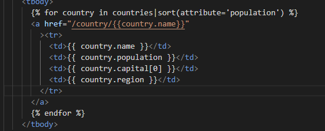
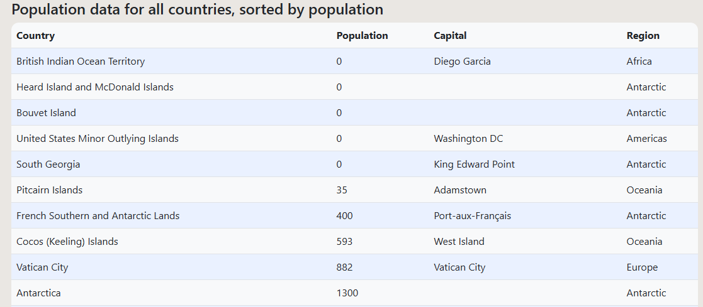
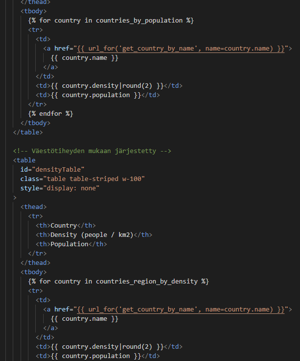
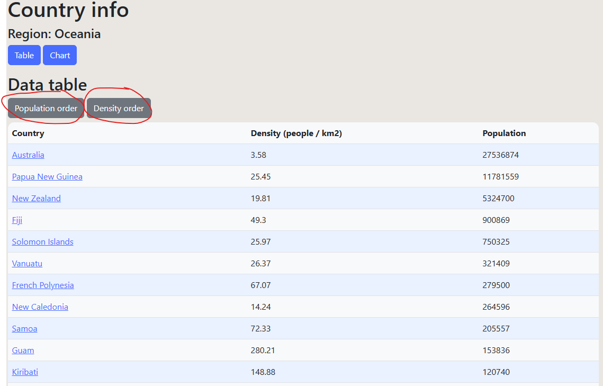
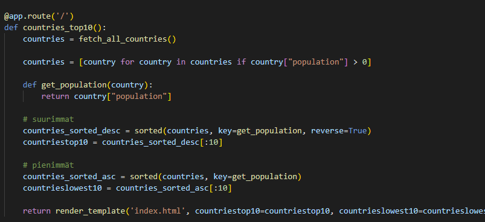
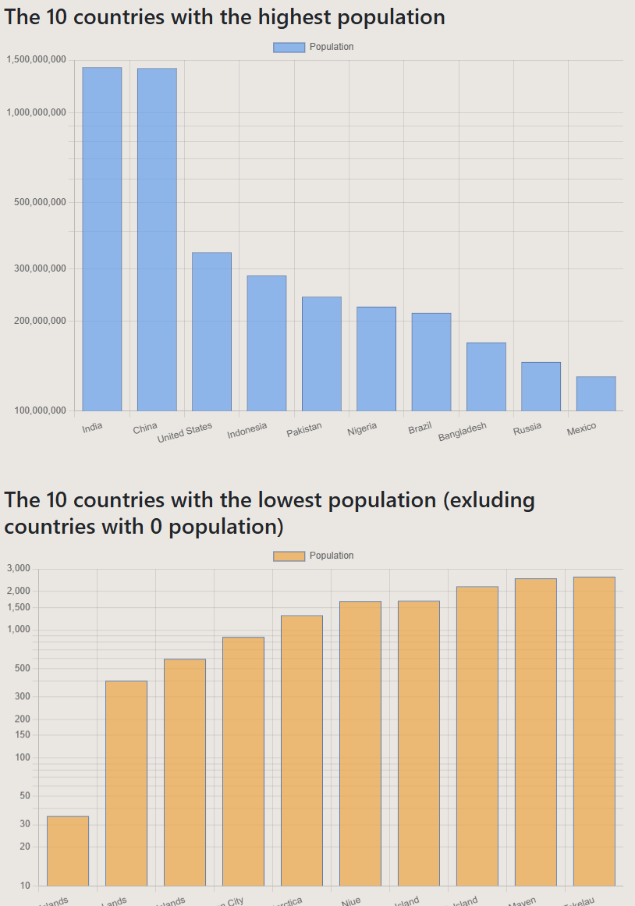
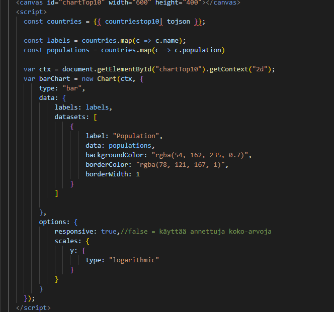

# Python practice project

This is a practice project for school. My main goals for this project are:

- To revise and deepen my understanding of Python programming
- To learn and apply a new Python framework (Flask) in practice
- To reinforce my skills in working with REST APIs and utilizing public data sources
- To improve my ability to structure and develop a small web application
- To focus on clear and comprehensive documentation, ensuring that the application can be easily understood and executed by others.

The main technologies used will be Flask and Python for the backend, and Jinja2, HTML, CSS, Bootstrap, JavaScript and Chart.js for the front-end. The documentation can be used later on as a guide for initializing Flask-projects.
Since I am a Windows-user, all the commands are for Windows. Commands for Mac or Linux might vary.

Checking your python version:

```
python --version
```

Checking where python is installed:

```
where python
```

## Flask

Flask is a lightweight web application framework for Python. (https://flask.palletsprojects.com/en/stable/). I followed this YouTube-video to get a basic understanding of Flask and Jinja2: https://www.youtube.com/watch?v=Z1RJmh_OqeA. The basic folder structure of the project and how flask is initialized is "copied" from the tutorial.

1. Creating a virtual environment. This creates an isolated environment for the project and is needed so that the project can have its own dependencies and use a specific version of the Python interpreteter. The following command can be used for installing the virtual environment. (https://docs.python.org/3/library/venv.html)

```
pip3 install virtualenv
```

Creating an virtual environment

I had some trouble using the newest version of python, and ended up using the version 3.11. Here is the command for creating the environment:

```
py -3.11 -m venv env
```

2. Activating the virtual environment

```
.\env\Scripts\Activate
```

Deactivating the virtual environment

```
deactivate
```

3. Installing Flask

```
pip install flask
```

4. Using Flask in the project
   In the app.py file, Flask needs to be imported:

```
from flask import Flask
```

## Jinja2

Jinja2 is a template engine for Python used to generate dynamic HTML content. Jinja2 works together with Flask and is installed together with Flask. Jinja2 supports template inheritance. (https://www.geeksforgeeks.org/python/templating-with-jinja2-in-flask/)
In my case, I for example used it to the other html-files to inherit the navigation bar from the base.html-file. One of the basic functionalities, is showing data from the backend by using render_template. It can also be used as for-loops for looping trough data in lists and if-statements for checking the data and front-end error handling.
This code:

(In this case the sorting is done with jinja2 in the frontend)

Generates this kind of table structure:


Here the sorting is done in the backend and JavaScript is used to define which data is used. Rounding is done using jinja2:




## Other front-end technologies and data visualization

Together with Jinja2 I decided to use Bootstrap for making the page user friendly in an easy way. For data visualization I am using chart.js together with JavaScript. Both are used trough CDN (Content Delivery Network) so I did not install them locally. (https://www.cloudflare.com/learning/cdn/what-is-a-cdn/) Since the templates are inherited from base.html, the only thing I had to do, was to add the links to them in the head of the base-file:

```
<link href="https://cdn.jsdelivr.net/...bootstrap.min.css" rel="stylesheet">
<script src="https://cdn.jsdelivr.net/...chart.js"></script>
```

Example of how flask and python grabs the data (two lists with different data) and sends it to frontend using render_template:






## Further development

I am happy that I got the chance to repeat python, fetching data and graphical tools and learned how to build the backend using a new technology. Some thoughts and ideas for future development:

- built in map in the country info page
- more options for sorting the data in the charts and tables
- more calculations in the backend
- options for filtering data, for example choosing only independent countries
- more data visualizations in different charts
- publishing the application
